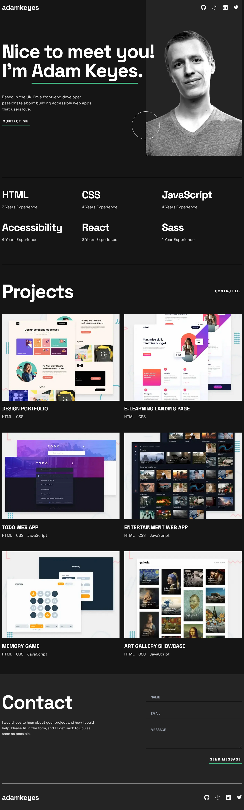

<!-- @format -->

# Frontend Mentor - Single-page developer portfolio solution

This is a solution to the [Single-page developer portfolio challenge on Frontend Mentor](https://www.frontendmentor.io/challenges/singlepage-developer-portfolio-bBVj2ZPi-x). Frontend Mentor challenges help you improve your coding skills by building realistic projects.

## Table of contents

- [Overview](#overview)
  - [The challenge](#the-challenge)
  - [Screenshot](#screenshot)
- [My process](#my-process)
  - [Built with](#built-with)
  - [Continued development](#continued-development)
  - [Useful resources](#useful-resources)
- [Author](#author)

**Note: Delete this note and update the table of contents based on what sections you keep.**

## Overview

### The challenge

Users should be able to:

- Receive an error message when the `form` is submitted if:
  - Any field is empty
  - The email address is not formatted correctly
- View the optimal layout for the interface depending on their device's screen size
- See hover and focus states for all interactive elements on the page
- **Bonus**: Hook the form up so it sends and stores the user's enquiry (you can use a spreadsheet or Airtable to save the enquiries)
- **Bonus**: Add your own details (image, skills, projects) to replace the ones in the design

### Screenshot

### Links

- Solution URL: [Github Repo](https://github.com/luAr26/single-page-developer-portfolio-code)
- Live Site URL: [Live demo](https://main--elaborate-cupcake-f41a2b.netlify.app/)

## My process

### Built with

- Semantic HTML5 markup
- CSS custom properties
- Flexbox
- Mobile-first workflow
- [React](https://reactjs.org/) - JS library
- [Next.js](https://nextjs.org/) - React framework
- [Tailwindcss](https://tailwindcss.com/) - For styles

### Continued development

I would like to continue using Next.js together with Tailwind until I'm getting comfortable with these tools.

### Useful resources

- [The Ultimate Guide To Forms In React Tutorial](https://www.youtube.com/watch?v=oPteQFUK42w) - This helped me with implementing form validation (starts at: [24:47](https://youtu.be/oPteQFUK42w?si=Y7XkHV8yk1bxlMXQ&t=1486)) in the contact section. I really liked this pattern and will use it going forward.
- [Formik docs](https://formik.org/docs/overview)

## Author

- Frontend Mentor - [@luAr26](https://www.frontendmentor.io/profile/luAr26)
